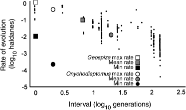

```{r pkgs}
library(deSolve)
library(reshape2)
library(ggplot2); theme_set(theme_bw())
```

## what are eco-evolutionary models?

- Slobodkin/Hutchinson: evolutionary theater, ecological play  
(i.e. ecological rates $\gg$ evolutionary rates)
- what if the rates are similar?
    - ecological dynamics (e.g. logistic equation)
    - evolutionary dynamics (changes in traits)
- alternatively, population genetics plus population dynamics

## why aren't all models like this?

- eco/evo time scales are often different
- it's hard!
    - most population genetic models assume constant population size
    - most ecological models assume constant traits

## [@ellner_does_2011]



(1 Haldane = change by a factor of 1 standard deviation/generation)

## endpoints

- ecology only: e.g. Lotka-Volterra predator-prey or competition; Rosenzweig-MacArthur model ...
- evolution (population genetics); e.g. see Lande, Lande and Arnold ... (discrete-time matrix models)

## how do we do it?

- range of realism/complexity
- individual or agent-based models
    - each individual has a genotype and a phenotype
    - rules for life history and interactions
- models for the distribution of a continuous trait
    - partial differential equations
    - reaction-diffusion equations
	- includes demography, mutation
- moment equations
    - simplify PDEs to equations for the means and variances of traits, plus population densities
- Price equations:
    - further simplify to equations for the means of traits (assume constant variance)

## individual-based models

- maximum detail, realism
- slow
- in R: try to be clever
- also: Python/Cython, C, NetLogo

## distribution models

- write equations to follow the fractions of the population
in each bin
- i.e. write out $dN(\alpha)/dt$  for $\alpha=0.01,0.02,...$
- move between bins via *mutation kernel*, e.g.
$m (-1 + C \sum_{i \neq j} \exp(-((\alpha_i-\alpha_j)/\sigma^2))$
where $C$ is a *normalization constant*, i.e. make sure the sum is 1/
population is balanced
- boundary conditions!

## PDEs

- advection (e.g. growth) $\partial N/\partial \alpha$
- diffusion (e.g. mutation): $\partial^2 N/\partial \alpha^2$

second partial derivatives by 

## moment equations

- figure out the dynamics of the mean *and* variance
- in general; mean follows 
- @birch_evolutionary_2015


## Price equations

- often used to decompose multi-level effects [@collins_integrating_2009]
- simplest version reduces to $d\bar T = V_0 \partial(\text{fitness})/\partial(T)$
- epidemic models: @day_general_2004; @day_insights_2006

## epidemic model

$$
\begin{split}
\frac{dS}{dt} & = m (N-S)- \beta(\bar \alpha) S I \\
\frac{dI}{dt} & = \beta(\bar \alpha) S I - (m + \alpha) I \\
\frac{d\bar\alpha}{dt} & = h \left(S \frac{\partial \beta}{\partial \bar \alpha} - 1 \right) \\
\beta(\bar\alpha) & = c \bar\alpha^{1/gamma}
\end{split}
$$

## R implementation

```{r inf1}
## tradeoff curve
beta = function(alpha,c0,gamma=2) { c0*alpha^(1/gamma) }
derivbeta = function(alpha,c0,gamma=2) { c0/gamma*alpha^(1/gamma-1) }
derivfun1 = function(t,y,parms) {
  derivs = with(as.list(c(y,parms)),
                c(m*(N-S)-beta(alpha,c0,gamma)*S*I,
                (beta(alpha,c0,gamma)*S-(m+alpha))*I,
                h*(S*derivbeta(alpha,c0,gamma)-1)))
  list(derivs)
}
```

## Parameters

```{r infparams}
params3 = c(h=5,c0=3,m=1,N=1,gamma=2)
startvals = c(S=0.999,I=0.001,alpha=1)
derivfun1(t=0,y=startvals,parms=params3)
L1 = ode(y=startvals,times=seq(0,30,by=0.1),
         parms=params3,func=derivfun1)
```

## default plot (a bit ugly)

```{r plot1,fig.width=8,fig.height=8}
plot(L1)
```

## nicer plot

```{r plot2}
Lm1 <- melt(as.data.frame(L1),id.vars="time") ## convert to long format
Lm1 <- transform(Lm1, vir=(variable=="alpha")) ## add var for faceting
gg1 <- ggplot(Lm1,aes(time,value,colour=variable))+
    geom_line()+
    scale_y_log10()
print(gg1 + facet_wrap(~vir,nrow=1,scale="free"))
```

## predator-prey system [@abrams_prey_1997]

- MacArthur-Rosenzweig model: logistic growth + Holling type II predation
- trait $C$ increases both growth rate and vulnerability of prey

$$
\begin{split}
\frac{dP}{dt} & = P \left(\frac{BCN}{1+hCN}-d \right) \\
\frac{dN}{dt} & = N \left( R + qC - kN -\frac{CP}{1+hCN} \right) \\
\frac{dC}{dt} & = V_0 \exp(-s/(C-s)) \left(q-\frac{P}{1+hCN}\right) 
\end{split}
$$

## what is the exponential term doing there?

```{r expterm,echo=FALSE}
par(las=1,bty="l")
s <- 0.001
curve(exp(-s/(x-s)),from=0.001,to=1)
```

## predator-prey system

Depending on parameters, this system can show

- expanding cycles
- stable cycles
- chaos
- stable equilibrium

## R implementation
```{r Ab1}
parms1 <- c(h=1, B=1, q=1.2, d=0.5, V0=0.1, R=0.5,
           k=0.5, s=0.001)
init <- c(P=2,N=2,C=1)
AMgrad <- function(t,y,parms) {
    grad <-with(as.list(c(y,parms)),
    {
        c(P=P*(B*C*N/(1+h*C*N)-d),
          N=N*(R+q*C-k*N-C*P/(1+h*C*N)),
          C=V0*exp(-s/(C-s))*(q-P/(1+h*C*N)))
    })
    return(list(grad))
}
## check that gradient function works
AMgrad(t=0,y=init,parms=parms1)
```

## run the model

```{r predprey_run}
L2 = ode(t=0:70,y=init,parms=parms1,func=AMgrad)
Lm2 <- melt(as.data.frame(L2),id.vars="time")
```

## plot

```{r predprey_plot}
gg1 %+% Lm2
```

```{r otherparams}
## limit cycles
parms2 <- c(h=1, B=1, q=0.8, d=0.5, V0=0.05, R=0.5,
            k=1, s=0.001)
## same but higher V0: chaotic/long-period limit cycles?
parms3 <- c(h=1, B=1, q=0.8, d=0.5, V0=0.075, R=0.5,
            k=1, s=0.001)
## expanding cycles for V0 larger (0.5)
## stable for V0 < 0.03148 ?
```

## Full-distribution models

Now let's build a full model for the distribution.

```{r dist1}
## define vector of virulence values
alphavec <- seq(0.01,10,by=0.1)
## correspond vector of transmission rates
betavec <- beta(alphavec,c0=3,gamma=2)
## mutation model
mut.sd <- 0.02   ## mutational std dev
## compute (alpha_i-alpha_j)^2 for all {i,j}
sqdist <- outer(alphavec,alphavec,"-")^2
## mutation distribution is Gaussian
M <- exp(-sqdist/(mut.sd)^2)
## make sure rows sum to 1 (conservation)
M <- sweep(M,MARGIN=1,FUN="/",STATS=rowSums(M))
all(abs(rowSums(M)-1)<1e-4) ## check
```

```{r}
## gradient function for distribution model
derivfun3 = function(t,y,parms) {
    S <- y[1]
    I <- y[-1]
    derivs = with(as.list(parms),
    {
        inf <- M %*% (betavec*S*I)  ## infection + mutation
        c(m*(N-S)-sum(inf),
          inf-(m+alphavec)*I)
    })
    list(derivs)
}
## initial values
init.I <- dnorm(alphavec,mean=1,sd=0.2)
init.I <- init.I/sum(init.I)*0.001
startvals.d <- c(S=0.999,init.I)
g1 <- derivfun3(t=0,y=init,parms=params3)[[1]]
tvec = seq(0,30,by=0.1)
L4 = ode(y=startvals.d,times=tvec,
         parms=params3,func=derivfun3)
persp(L4[,-(1:2)])
Itot <- rowSums(L4[,-(1:2)])
## library(rgl)
## persp3d(tvec,alphavec,L4[,-(1:2)])
```

## references
